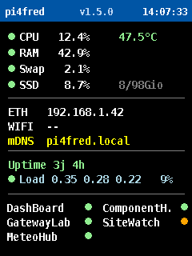
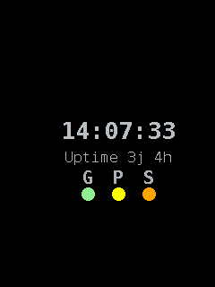

# RaspberryDashboard

*Lire dans une autre langue : [English](README.md) · **Français** (ce document).*


Tableau de bord système pour Raspberry Pi, affiché sur un petit écran
**ILI9341 ou ST7789 SPI (240 × 320)**. Il donne, en un coup d'œil, l'état de santé
de la machine : CPU, mémoire, disque, charge, réseau et services — et la
**présence des applications de bureau** de l'atelier (ComponentHub, SiteWatch…)
sur le réseau local.

L'objectif : connaître l'état du Raspberry en moins d'une seconde, sans clavier
ni écran principal.

## Aperçu de l'affichage



    ┌────────────────────────────────────┐
    │ pi4fred          v1.2.1     13:25:59│   bandeau : hôte / version / heure
    ├────────────────────────────────────┤
    │ ● CPU    2.1 %        43.7 °C        │   pastille de santé + température
    │ ● RAM   42.9 %                       │
    │ ● Swap   2.1 %                       │
    │ ● SSD    8.7 %       8 / 98 Gio      │   % occupé + utilisé / capacité
    ├────────────────────────────────────┤
    │ ETH   192.168.1.42                   │
    │ WIFI  --                             │
    │ mDNS  pi4fred.local                  │
    ├────────────────────────────────────┤
    │ Uptime 3j 4h              REBOOT!    │   si un reboot non demandé est détecté
    │ ● Load 0.15 0.22 0.30   4 %          │   moyennes 1/5/15 min + % cœurs
    ├────────────────────────────────────┤
    │ DashBoard       ● ComponentH.   ●    │   services systemd (gauche) +
    │ GatewayLab      ● SiteWatch     ●    │   applis de bureau via morfBeacon
    │ MeteoHub        ●                    │   (droite) — 6 max, noms abrégés
    └────────────────────────────────────┘

Les **pastilles** changent de couleur selon des seuils :

-   🟢 **Vert** : fonctionnement normal / en ligne
-   🟠 **Orange** : seuil d'avertissement
-   🔴 **Rouge** : seuil critique / hors ligne

## Matériel

Voir [docs/fr/HARDWARE.md](docs/fr/HARDWARE.md) pour l'écran, le brochage et le
SPI, et [docs/fr/CABLAGE.md](docs/fr/CABLAGE.md) pour le câblage détaillé.

## Installation

Voir [docs/fr/INSTALL.md](docs/fr/INSTALL.md) pour l'installation en service
`systemd` (démarrage automatique au boot).

Test rapide, sans installer le service :

``` bash
cd ~/Codage/Python/RaspberryDashboard
python3 dashboard.py
```

## Configuration

Tous les réglages sont centralisés dans [config.py](config.py).

### Seuils de santé

Chaque métrique possède un seuil d'avertissement et un seuil critique :

``` python
CPU_WARNING = 70      ;  CPU_CRITICAL = 90
RAM_WARNING = 80      ;  RAM_CRITICAL = 95
SWAP_WARNING = 20     ;  SWAP_CRITICAL = 50
TEMP_WARNING = 65     ;  TEMP_CRITICAL = 75      # °C
SSD_WARNING = 85      ;  SSD_CRITICAL = 95
LOAD_WARNING = 100    ;  LOAD_CRITICAL = 150     # % des cœurs
```

`LOAD` est exprimé en pourcentage des cœurs : `100 %` = tous les cœurs
pleinement occupés.

### Services surveillés (systemd / ESP32)

Les services affichés sont définis dans `SERVICE_LABELS` — la **clé** est le nom
de l'unité, la **valeur** le libellé affiché :

``` python
SERVICE_LABELS = {
    "dashboard":  "DashBoard",     # service systemd local (systemctl is-active)
    "gatewaylab": "GatewayLab",    # ESP32 (sonde réseau)
    "meteohub":   "MeteoHub",      # ESP32 (sonde réseau)
}
```

Un service **local** (comme le dashboard lui-même) est testé par
`systemctl is-active`. Un service **ESP32**, qui n'a pas de systemd, est déclaré
en plus dans `NETWORK_SERVICES` et testé par une sonde TCP sur son serveur web.

### Applications de bureau (heartbeat morfBeacon)

En plus des services systemd, le dashboard **écoute** sur le réseau local les
applications de bureau (**ComponentHub**, **SiteWatch**, futurs outils) qui
diffusent un petit heartbeat UDP « je suis actif » (protocole morfBeacon, port
`45454`). Rien à configurer côté réseau : découverte automatique, aucune IP à
connaître. Une application sans heartbeat depuis `BEACON_OFFLINE_AFTER` secondes
est affichée hors ligne.

``` python
BEACON_APPS = {
    "ComponentHub": "ComponentHub",
    "SiteWatch":    "SiteWatch",
}
```

Ajouter un futur projet ne demande qu'une ligne. La zone d'état affiche jusqu'à
**6 surveillances sur deux colonnes** (services systemd + applications de
bureau) ; les noms trop longs sont abrégés et terminés par « . ».

### Alerte reboot non demandé

Si un script de surveillance des redémarrages crée un rapport dans
`/home/morfredus/Logs/`, le dashboard affiche un badge rouge `REBOOT!` sur la
ligne `Uptime`. Réglages dans `config.py` (`REBOOT_ALERT_*`) ; acquittement sans
supprimer les logs via `python3 reboot_ack.py`. Détails :
[docs/fr/INSTALL.md](docs/fr/INSTALL.md).

### Alertes e-mail via morfNotify

Le dashboard peut envoyer une notification à `morfNotify` quand une vraie alerte
persiste : métrique au seuil critique pendant `ALERT_MIN_DURATION_SECONDS`,
service/application hors ligne pendant `ALERT_SERVICE_MIN_DURATION_SECONDS`, ou
reboot non demandé détecté. Ce n'est pas déclenché par un simple passage bref au
rouge.

``` python
ALERT_NOTIFY_ENABLED = True
ALERT_NOTIFY_URL = "http://127.0.0.1:8789/notify"
ALERT_NOTIFY_TARGETS = ["email"]
ALERT_MIN_DURATION_SECONDS = 5 * 60
ALERT_SERVICE_MIN_DURATION_SECONDS = 2 * 60
ALERT_REPEAT_COOLDOWN_SECONDS = 6 * 60 * 60
```

Le canal est choisi côté configuration : `["email"]`, `["telegram"]` ou
`["email", "telegram"]` selon les destinations activées dans `morfNotify`.

L'intégration est volontairement faible : si `morfNotify` est absent,
injoignable ou mal configuré, le dashboard ignore l'échec et continue à afficher
l'état local normalement.

### Version

Le numéro affiché dans le bandeau est lu dans le fichier `VERSION` à la racine.
En son absence, `dev` est affiché.

## Écran de veille (anti-marquage / économie d'énergie)



Après `SCREENSAVER_IDLE_SECONDS` (60 s) **sans activité SSH**, le dashboard
laisse place à un **cadre de veille** minimal — une petite boîte repositionnée à
chaque rafraîchissement — affichant l'heure, l'uptime et une rangée de trois
pastilles d'état :

-   **G** — global / thermique : 🟢 OK · 🟠 ça chauffe · 🔴 critique
-   **P** — charge processeur (4 niveaux) : 🟢 < 50 % · 🟡 50–70 % · 🟠 70–90 % · 🔴 ≥ 90 %
-   **S** — services : 🟢 tous actifs · 🟠 au moins un hors ligne (jamais rouge ;
    le service `dashboard` est exclu du test)

Le rétroéclairage descend à `SCREENSAVER_BACKLIGHT` et remonte à fond dès que tu
touches une session SSH. La présence est déduite de l'activité des terminaux SSH
(`activity.py`), en attendant un vrai capteur de présence.

``` python
SCREENSAVER_ENABLED = True       # False = dashboard permanent, jamais de veille
SCREENSAVER_IDLE_SECONDS = 60    # inactivité SSH avant la veille
SCREENSAVER_BACKLIGHT = 15       # rétroéclairage (%) en veille
BACKLIGHT_PWM = True             # False = rétroéclairage tout-ou-rien (sans variation)
BACKLIGHT_FULL = 100
```

Ce sont des dalles LCD (ST7789 / ILI9341) : le marquage permanent est surtout un
phénomène OLED ; le vrai gain ici est le rétroéclairage réduit (consommation,
durée de vie de la LED), le cadre mobile ne servant que contre la rémanence
temporaire.

## Métriques détaillées à la demande (SSH)

L'écran est passif : il n'affiche que la **présence** (en ligne / hors ligne).
Pour lire les **métriques détaillées** d'une application sans clavier, lancer
`beacon_status.py` en SSH — il découvre les applis vivantes, interroge leur
endpoint `/status` et écrit un rapport Markdown lisible (`beacon_status.md`) :

``` bash
python3 beacon_status.py                   # console + beacon_status.md
python3 beacon_status.py --app SiteWatch    # une seule application
python3 beacon_status.py --listen 8         # fenêtre d'écoute plus longue
python3 beacon_status.py --no-file          # console seulement
```

## Documentation

-   [docs/fr/ARCHITECTURE.md](docs/fr/ARCHITECTURE.md) — structure du projet et rôle des modules
-   [docs/fr/HARDWARE.md](docs/fr/HARDWARE.md) — matériel et brochage
-   [docs/fr/CABLAGE.md](docs/fr/CABLAGE.md) — câblage détaillé
-   [docs/fr/INSTALL.md](docs/fr/INSTALL.md) — installation du service systemd
-   [CHANGELOG.md](CHANGELOG.md) — historique des versions
-   [ROADMAP.md](ROADMAP.md) — évolutions prévues
-   [CONTRIBUTING.md](CONTRIBUTING.md) — guide de contribution

> Index de la documentation : [`docs/fr/`](docs/fr/README.md) (français) ·
> [`docs/en/`](docs/en/README.md) (anglais).

## Licence

Distribué sous la licence [GPL-3.0-only](LICENSE). © 2026 morfredus.
